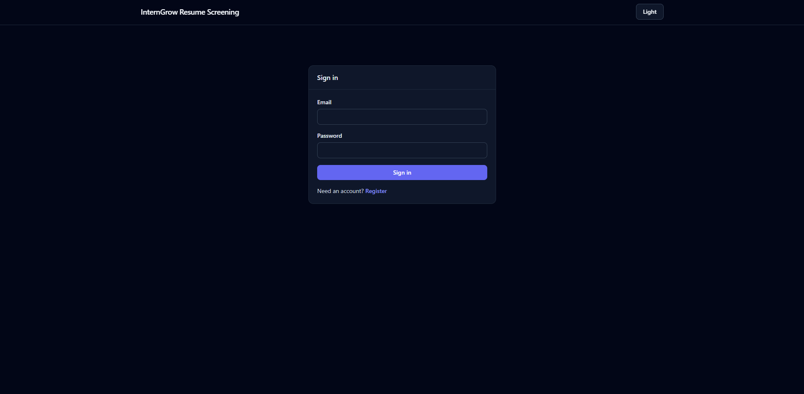
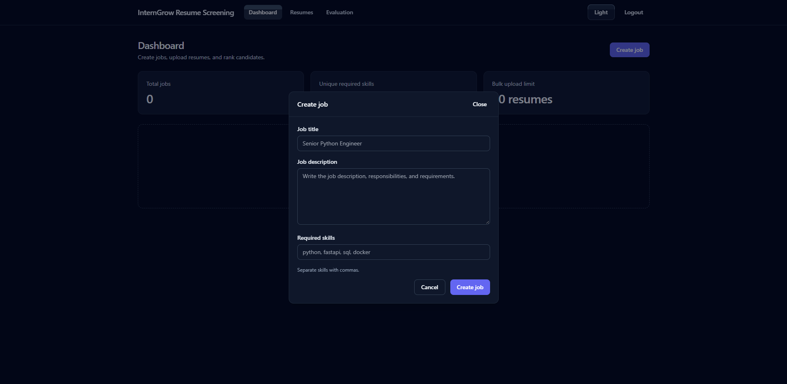
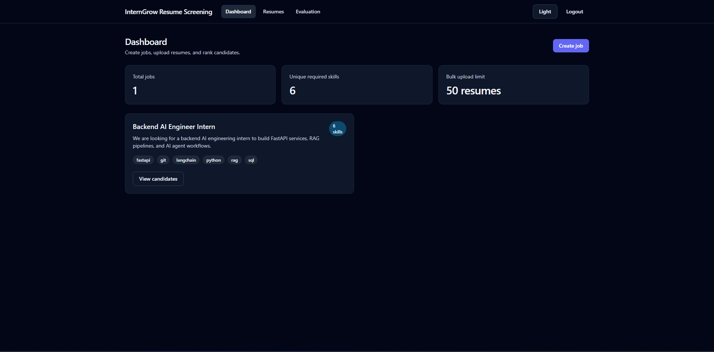
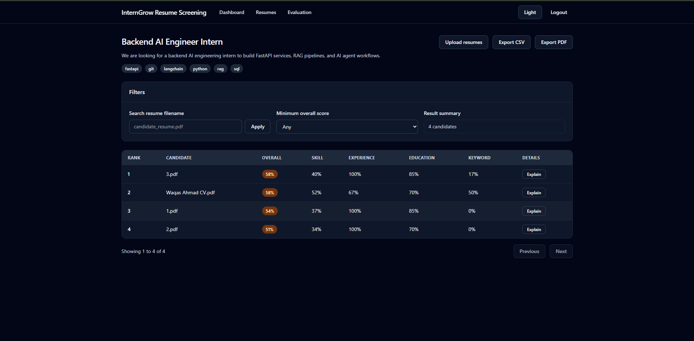
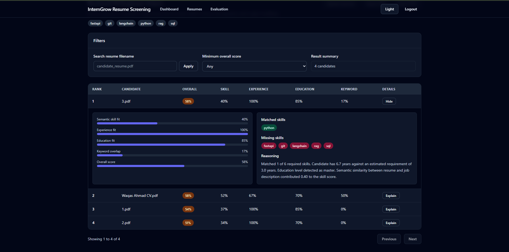
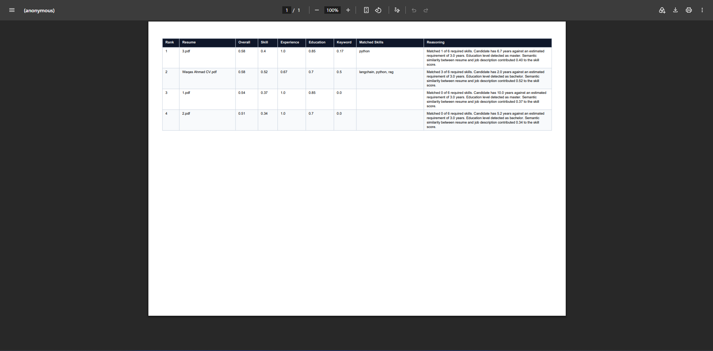
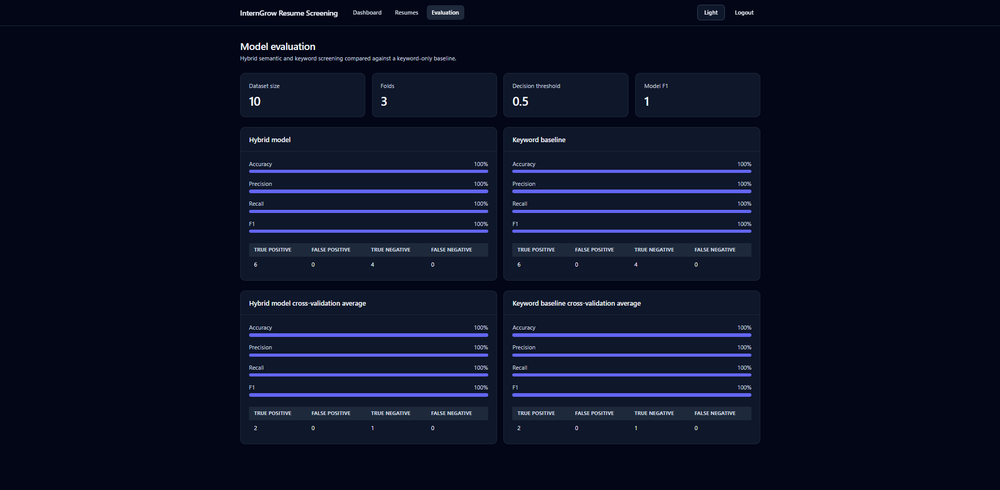
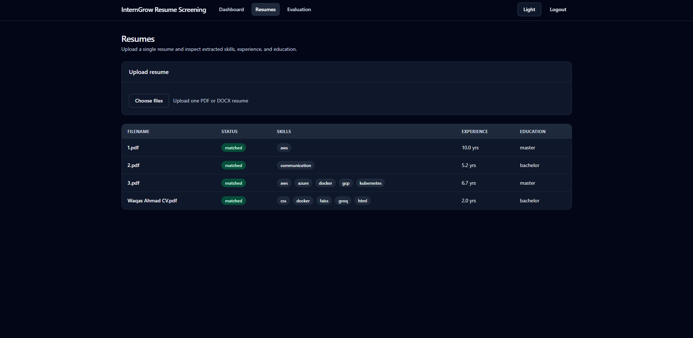

# InternGrow Resume Screening

An AI-assisted resume screening system. Recruiters create a job, upload PDF/DOCX resumes (single or bulk), and get back a ranked list of candidates with per-dimension scores and a plain-language explanation for each one.

**Demo video:** _add link here_ · **Live app:** _add link here_ · **API docs:** `http://localhost:8000/docs`

## Screenshots

| | |
|---|---|
|  |  |
|  |  |
|  |  |
|  |  |

## Features

- Registration, login and JWT-protected API
- Job creation with a description and a list of required skills
- Single and bulk resume upload (PDF and DOCX; limits: 50 files per bulk upload, 10 MB per file)
- Text extraction with an OCR fallback for scanned PDFs
- Extraction of skills, years of experience, education level, emails and phone numbers
- Candidate scoring and ranking against each job, with an explanation per candidate
- Search by filename, minimum-score filter and pagination
- CSV and PDF export of the ranked candidates
- Evaluation endpoint and page that report precision, recall, F1 and accuracy
- Light and dark theme

## Tech stack

| Layer | Technology |
|---|---|
| Backend | FastAPI, SQLAlchemy (async), SQLite (aiosqlite), Pydantic, PyJWT, bcrypt |
| NLP / ML | spaCy (`en_core_web_sm`), sentence-transformers (`all-MiniLM-L6-v2`), PyMuPDF, python-docx, pytesseract |
| Frontend | React 18, TypeScript, Vite, Tailwind CSS, TanStack Query, React Router |
| Tests | pytest (backend), Vitest + Testing Library (frontend) |
| Export | ReportLab (PDF), csv (CSV) |
| Deploy | Render (backend, `render.yaml`), Vercel (frontend, `vercel.json`) |

## Architecture

```
React (Vite)  ──HTTP/JSON──▶  FastAPI
                               ├── api/routes      auth, jobs, resumes, evaluation, health
                               ├── services        extraction, scoring, matching, export, auth
                               ├── ai              NLP extractor, profile parsers, semantic matcher, OCR fallback
                               ├── repositories    users, jobs, resumes, candidate matches
                               └── SQLite
```

## Resume processing pipeline

1. **Upload** – file type and size are validated.
2. **Text extraction** – PyMuPDF for PDFs and python-docx for DOCX. If a PDF has almost no text layer, OCR is used instead.
3. **Profile extraction**
   - *Skills*: spaCy `PhraseMatcher` over a skills taxonomy with synonyms.
   - *Experience*: explicit phrases ("3 years") plus date ranges ("Jan 2022 – Present") read from the Experience section. Overlapping roles are merged so they are not counted twice.
   - *Education*: word-boundary patterns for PhD, master's, bachelor's (including "BS", "BSc", "B.Tech") and associate degrees.
   - *Contact*: emails and phone numbers by regex.
4. **Matching and scoring** – the extracted profile is scored against the job (below).
5. **Ranking** – candidates are sorted by overall score, then filtered and paginated by the API.

## Scoring

```
overall = 0.45 · skill + 0.25 · experience + 0.15 · education + 0.15 · keyword
```

| Component | How it is computed |
|---|---|
| Skill | Semantic similarity between the resume and the job description, using sentence-transformer embeddings |
| Experience | `min(candidate years / required years, 1.0)`; the requirement is read from the job description and defaults to 3 years |
| Education | Candidate's degree level compared with the job's requirement (or a default weight per level if none is stated) |
| Keyword | Fraction of the job's required skills found in the resume |

Every candidate gets a text explanation listing matched skills, years found versus required, the detected education level and the semantic-similarity contribution.

## Evaluation

`GET /api/evaluation/resume-screening` runs a k-fold evaluation of the scorer against a small labelled dataset and reports precision, recall, F1 and accuracy.

| Setting | Value |
|---|---|
| Dataset size | 10 labelled examples |
| Folds | 3 |
| Precision / Recall / F1 / Accuracy | 1.0 / 1.0 / 1.0 / 1.0 |

**Caveat:** the dataset is tiny and hand-built, so these numbers show the pipeline is working end to end. They are not evidence of real-world accuracy. A larger, independently labelled set of real resumes is needed for that.

## Getting started

### Prerequisites

Python 3.11+, Node 18+, and (optional, for scanned PDFs) the Tesseract OCR binary.

### Backend

```bash
cd backend
python -m venv .venv
# Windows: .venv\Scripts\activate    macOS/Linux: source .venv/bin/activate
pip install -r requirements.txt
python -m spacy download en_core_web_sm
cp .env.example .env        # then edit .env, see below
uvicorn app.main:app --reload --port 8000
```

API docs: http://localhost:8000/docs · Health: `/healthz`, `/readyz`

### Frontend

```bash
cd frontend
cp .env.example .env        # VITE_API_URL=http://localhost:8000
npm install
npm run dev                 # http://localhost:5173
```

### Tests

```bash
cd backend  && pytest -q     # backend
cd frontend && npm test      # frontend
cd frontend && npm run build # type-check and production build
```

### Environment variables

| Variable | Purpose | Default |
|---|---|---|
| `DATABASE_URL` | SQLAlchemy URL | `sqlite+aiosqlite:///./interngrow.db` |
| `SECRET_KEY` | JWT signing key. **Set a long random value (32+ characters).** | `change-me` |
| `ALLOWED_ORIGINS` | CORS origins (JSON list) | `["http://localhost:5173","http://localhost:3000"]` |
| `SPACY_MODEL` | spaCy model name | `en_core_web_sm` |
| `SENTENCE_TRANSFORMER_MODEL` | Embedding model | `all-MiniLM-L6-v2` |
| `MAX_BULK_UPLOAD` | Files per bulk upload | `50` |
| `MAX_FILE_SIZE_MB` | Max file size | `10` |
| `SEED_EMAIL`, `SEED_PASSWORD` | Optional demo account | – |
| `VITE_API_URL` (frontend) | Backend base URL | `http://localhost:8000` |

Generate a secret with: `python -c "import secrets; print(secrets.token_urlsafe(48))"`

## API overview

| Method | Path | Description |
|---|---|---|
| POST | `/api/auth/register`, `/api/auth/login` | Create an account, get a JWT |
| GET | `/api/auth/me` | Current user |
| GET, POST | `/api/jobs` | List and create jobs |
| GET | `/api/jobs/{job_id}` | Get a job |
| POST | `/api/jobs/{job_id}/resumes` | Bulk upload resumes to a job |
| GET | `/api/jobs/{job_id}/candidates` | Ranked candidates (search, `min_score`, `limit`, `offset`) |
| GET | `/api/jobs/{job_id}/candidates/export/csv`, `/export/pdf` | Export candidates |
| POST | `/api/resumes/upload` | Upload and parse a single resume |
| GET | `/api/resumes`, `/api/resumes/{resume_id}` | List and fetch resumes |
| GET | `/api/evaluation/resume-screening` | Evaluation report |

## Deployment

- **Backend (Render):** `render.yaml` defines the service. Set `SECRET_KEY`, `SEED_PASSWORD` and `ALLOWED_ORIGINS` (your frontend URL) in the Render dashboard.
- **Frontend (Vercel):** set the root to `frontend`, set `VITE_API_URL` to your backend URL, and deploy. `vercel.json` handles SPA routing.
- SQLite on Render's free tier is ephemeral, so data resets on redeploy. Use Postgres for anything persistent.

## Limitations and future improvements

- The extractor does not check that a file is actually a resume. Any PDF will be scored.
- Uploading the same file twice creates two candidates. Content hashing would prevent duplicates.
- Experience is estimated from date ranges and phrases, so unusual layouts (multi-column, dates split across lines) can be missed.
- The skills taxonomy is fixed. Extending it, or learning skills from job descriptions, would improve recall.
- Evaluation uses a 10-example dataset. A larger labelled set is needed for meaningful accuracy numbers.
- Move to Postgres, add background processing for large bulk uploads, and add role-based access for multiple recruiters.
